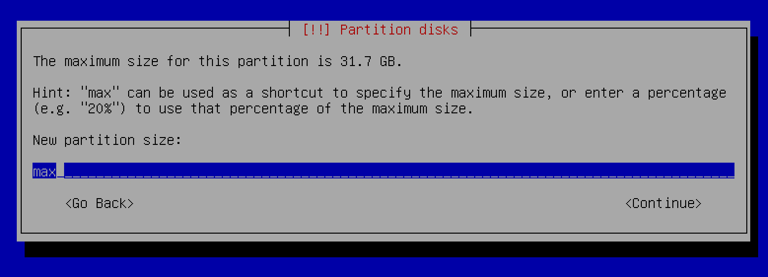

# 🙇‍♂️ Installing the VM and configure the same

#### <mark style="color:purple;">First step (if you don´t have</mark> <mark style="color:purple;"></mark><mark style="color:purple;">**Type 2 hypervisors**</mark><mark style="color:purple;">) is installing one?</mark>&#x20;

> [!info]
> How to install one? Is simple just go to the site of the chose one, for this project it will be used the [Virtual-Box](https://www.virtualbox.org/) and download it.  &#x20;

#### **With the virtual-box installed just open it and start creating your VM.**

<figure><figcaption></figcaption></figure>

> Note that the memory, name and processors don\`t need to be 100% as the tutorial or like the subject of the project ask, the important is to allocate the necessary memory for what the subject ask you to...

> [!info]
> The type of the file needs to correspond to the type that you want to create, in this case we will choose for 64bytes systems.  &#x20;

#### Now with the VM created is time to configure it !!! &#x20;

> [!warning]
> #### We need to have in mind that part of the initial configuration differs for the mandatory part and bonus. and that the project itself does not allow graphical interface.

* The first part is the pretty straight forward, is like others OS where we need to configures dates, time zones, languages...
  *   first is initializing the OS, and them we select:

      * lenguage;
      * Location;
      * Locales (locales tell your system how to display things ) ;&#x20;
      * Keyboard;

  * Then we configure the network !
    * Host-name (following the rules in the subject);
    * ~~The Domain~~ (is not necessary) ;
    * Now we setup :warning: users and passwords for the root user :warning:  (remember the rules of passwords)
    * Setup another user that is no the root user  :warning: ;
    * &#x20;Time zone;

#### Now we configure the partitions&#x20;

> [!info]
> _**This part will show the full partitions for the bonus part !!!**_

> **What are partitions ??**&#x20;
>
> <mark style="background-color:$info;">A partition is a logical division of a physical storage device, basically just like dividing one big bookshelf into smaller sections, each used for different purposes.</mark> &#x20;
>
> &#x20;                      <mark style="color:$danger;background-color:$danger;">**In another note the values of storage in the picture mite be wrong**</mark>                       &#x20;

**First we need to choose &#x20;**<mark style="background-color:$warning;">**Manual**</mark>**&#x20;  in partition disks; Next it showing us the part of the disk that we want to mount the partition; right now we only have one (all disk), after selecting it we confirm the message.**

<figure><figcaption></figcaption></figure>

In the next step we start to create the first partition table in the free space that we have.&#x20;

* We select create new Partition;

<figure><figcaption></figcaption></figure>

<figure><figcaption></figcaption></figure>

* We accept the confirmation message. Basically, it warns us if we are sure to create a new empty partition table.

<figure><figcaption></figcaption></figure>

* After we can see our partition table empty:

<figure><figcaption></figcaption></figure>

* After we select our free and only partition table to start crating the first `partition (sda1)`&#x20;

<figure><figcaption></figcaption></figure>

* them we allocate the memory size just like the subject; after that we select the type of the partition, that is the primary. And them we where the partition will be set, (in the beginning of the free space);

<figure><figcaption></figcaption></figure>

<figure><figcaption></figcaption></figure>

<figure><figcaption></figcaption></figure>

* After setting the partition we need to mount it in the specific mount point&#x20;

<figure><figcaption></figcaption></figure>

After  creating the first partitions is time to create the second manual partition in remaining free space

<figure><figcaption></figcaption></figure>

* this second partition will have the the rest of free space and will be a **logical** partition and will also be encrypted&#x20;
* the steps are basically the same as before for the first one, whit the difference of the memory that will the max value, and the type of it, that **will be a logical instead of primary.**
* and we will not be mount it, so in the mount point will choose the not mount it option.&#x20;
* After setting the partition we will have a message to confirm the changes of the disk
* Then is time to start to create the encrypted volumes and selecting the partition that will be encrypted,  that will be the last partition created "sda5"
* Now is time to start encrypting this partition, first we start to select  `configure encrypted volumes`
* then we accept the confirmation message and them we created the encrypted volumes&#x20;
* the steps are basically the same as before for the first one, whit the difference of the memory that will the max value, and the type of it, that **will be a logical instead of primary.**

<figure><figcaption></figcaption></figure>

> [!info]
> #### what\`s the difference between primary and logical partition??
> 
> A **primary partition** is a _main_ partition that your operating system can directly use to install an OS or store files. Each primary partition acts like an independent disk.
> 
> A **logical partition** is a **subdivision of an extended partition** on a hard disk.\
> It acts like a normal partition and can store data or an operating system, but it exists **inside** an extended partition rather than directly on the physical disk.

> [!warning]
> Today, most modern systems use **GPT** instead of **MBR** — **GPT** removes these old limits:

<figure><figcaption></figcaption></figure>

* and we will not be mount it, so in the mount point will choose the **`not mount it`** option.&#x20;

<figure><figcaption></figcaption></figure>

* After setting the partition we will have a message to confirm the changes of the disk

<figure><figcaption></figcaption></figure>

* Then is time to start to create the encrypted volumes and selecting the partition that will be encrypted&#x20;

<figure><figcaption></figcaption></figure>

<figure><figcaption></figcaption></figure>

<figure><figcaption></figcaption></figure>

* After we finish sting up our 2 partition already encrypted&#x20;
* Now we will start the `configuration of the encrypted volumes` selecting that option, after selecting that option we confirm again another "confirmation message"&#x20;

<figure><figcaption></figcaption></figure>

> [!danger]
> &#x20;                              <mark style="color:$danger;">**same steps are being skip, so pay attention on what you\`re doing**</mark> &#x20;

<figure><figcaption></figcaption></figure>

* Now we start creating the encrypted volumes on the encrypted partition (sda5)&#x20;

<figure><figcaption></figcaption></figure>

<figure><figcaption></figcaption></figure>

* then we confirm the  message that tells us that everything inside the partition is going to be encrypted and then we skip that process, because the partition is empty&#x20;

<figure><figcaption></figcaption></figure>

<figure><figcaption></figcaption></figure>

* After we crate a password to encrypt and confirm it, <mark style="color:$danger;background-color:red;">**is better to not forget that password**</mark>&#x20;

<figure><figcaption></figcaption></figure>

<figure><figcaption></figcaption></figure>

* Now is time to start the configuration of LVM — `Logical Volume Manager` &#x20;

> [!info]
> Because the processes is very similar on all the logical volume this will have only the first one and the volume group &#x20;

* So the first step is to create our volume group "LVMGroup" on the encrypted partition.&#x20;

<figure><figcaption></figcaption></figure>

<figure><figcaption></figcaption></figure>

* After we start to create our logical volumes, having in mind the example on the subject in the bonus part&#x20;

<figure><figcaption></figcaption></figure>

* lets now  create the the  \<logical volume root>&#x20;
* first we select create logical volume and them then the group where it going to be,  in this case we have only one

 

<figure><figcaption></figcaption></figure>

* we give it a name and the size its going to have &#x20;

<figure><figcaption></figcaption></figure>

<figure><figcaption></figcaption></figure>

> [!success]
> then we repeat this step until we have crated all the logical volumes inside the group&#x20;

* Having all the logical volumes done we now start the file system of all logical volumes, choosing how we are going to use it and where we will mount it until we get something like that: &#x20;

<figure><figcaption></figcaption></figure>

> [!info]
> **What Is a File System?**
> 
> A **file system** is the **method and structure** an operating system uses to **store, organize, retrieve, and manage data** on a storage device (like a hard drive, SSD, or USB stick).
> 
> In simple terms:
> 
> > A **file system** is like the **"map" or "organizer"** of your storage — it decides _how_ files are named, saved, and located on the disk.
> >
> > "ext4" ⇒  The default Linux file system. Stable, fast, reliable.

> [!warning]
> ### **What Are “LVMs”?** ➡️ **Logical Volume Manager**
> 
> So when you see things like `LVGroup-root`, `LVGroup-home`, or `LVGroup-swap` — those are **Logical Volumes managed by LVM**.
> 
> **LVM** is a **flexible way to manage disk partitions** in Linux.\
> Instead of fixed-size partitions (like `/dev/sda1`, `/dev/sda2`), LVM lets you **create, resize, and move** “virtual partitions” called **logical volumes** easily.
> 
> Think of it as a **layer between your physical disks and your file systems.**

> [!info]
> Encrypting a partition isn’t mandatory, but it’s a **strong security practice**, especially for systems that handle personal or sensitive data.
> 
> When you **encrypt a partition**, all the data stored on it is **converted into unreadable code** using a **cryptographic key**.\
> Only someone with the **correct password (or key)** can unlock and read it.
> 
> So even if someone **steals your hard drive**, they can’t access your files — everything looks like random noise.

